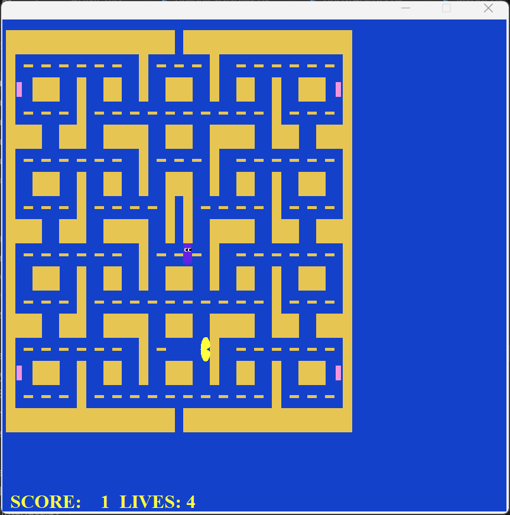

# Pac-Man 游戏项目

一个功能完整的 Pac-Man 游戏实现，支持回合制游戏、自动地图生成、无限关卡循环等特性。



## 项目简介

本项目基于 UC Berkeley 的 Pac-Man AI 项目修改，实现了以下核心功能：

- ✅ **回合制游戏模式**：Pac-Man 先移动，然后 Ghost 依次移动
- ✅ **无限关卡循环**：完成一关后自动进入下一关，生命+1，食物和能量豆刷新
- ✅ **传送门系统**：地图中的 `Q` 字符表示传送门，Pac-Man 可传送，Ghost 视为墙
- ✅ **自定义 Ghost 数量**：可指定任意数量的 Ghost，所有 Ghost 从同一位置初始化
- ✅ **自动地图生成**：支持自动生成连通的地图，包含传送门、食物、能量豆等
- ✅ **Ghost 复活机制**：Ghost 被吃后等待 16 回合复活，白色鬼持续时间随吃鬼次数递减
- ✅ **可自定义显示**：支持调整食物/能量豆颜色和尺寸、背景颜色、网格比例等
- ✅ **多种 Agent 类型**：支持键盘控制、随机移动、贪心算法等

## 快速开始

### 安装依赖

```bash
pip install -r requirements.txt
```

### 基本使用

```bash
# 使用默认设置（键盘控制，4个Ghost）
python test_turn_based.py

# 查看所有命令行参数
python test_turn_based.py --help
```

## 命令行参数

| 参数 | 简写 | 说明 | 默认值 |
|------|------|------|--------|
| `--layout` | `-l` | 地图名称（不含.lay扩展名） | `merged_mask_frame_0_small` |
| `--ghosts` | `-g` | Ghost 数量 | `4` |
| `--agent` | `-a` | Pac-Man agent 类型 | `keyboard` |
| `--mode` | `-m` | 游戏模式 | `turn-based` |
| `--zoom` | `-z` | 窗口缩放比例 | `0.5` |
| `--output` | `-o` | 输出目录 | `turn_based_output` |

### Agent 类型

- **`keyboard` / `manual`**: 手动控制（键盘）
  - `W/↑`: 向上 | `S/↓`: 向下 | `A/←`: 向左 | `D/→`: 向右
  - `空格`: 停止 | `Q`: 退出
- **`random`**: 随机移动
- **`greedy`**: 贪心算法（朝最近食物移动）

### 使用示例

```bash
# 1. 使用自动生成的地图，2个Ghost，随机agent
python test_turn_based.py -l auto_generated -g 2 -a random

# 2. 使用贪心agent，6个Ghost
python test_turn_based.py -l test_map -g 6 -a greedy

# 3. 完整参数示例
python test_turn_based.py \
  --layout auto_generated \
  --ghosts 4 \
  --agent keyboard \
  --zoom 0.5
```

## 地图生成

使用地图生成器创建新地图：

```bash
# 生成地图：宽度 高度 食物密度 能量豆数量 输出文件
python map_generator.py 25 25 0.75 4 layouts/my_map.lay

# 使用生成的地图
python test_turn_based.py --layout my_map
```

**参数说明**：
- 宽度/高度：地图尺寸（建议奇数，如 21, 25, 31）
- 食物密度：0-1 之间的浮点数（0.7-0.8 为推荐值）
- 能量豆数量：通常 4 个
- 输出文件：保存路径（默认 `layouts/auto_generated.lay`）

**生成规则**：
- 最外圈自动设置为墙壁
- 确保地图连通性
- 自动放置两个传送门（Q）在最外层墙壁
- 食物必须空一格（不相邻）
- 能量豆尽可能分散

## 游戏规则

### 生命系统
- 初始生命数：**4 条**
- 失去生命后继续游戏，所有角色重置到起始位置
- 游戏结束条件：生命数 ≤ 0

### 分数系统
| 项目 | 分数 |
|------|------|
| 糖豆（Food Pellet） | 1 分 |
| 能量丸（Power Pellet） | 5 分 |
| 连续吃第 n 个鬼 | 10 × 2^n 分 |
| 完成一关 | 500 分 |

### 无限关卡
- 当所有食物被吃光时，自动进入下一关
- 生命 +1，所有角色重置，食物和能量豆刷新
- 分数和吃鬼次数继续累计
- 游戏可无限进行（只要有生命）

### Ghost 系统
- **AI 类型**：智能 Ghost（使用 A* 算法追踪 Pac-Man）
- **正常状态**：追踪 Pac-Man
- **恐惧状态**：逃离 Pac-Man（白色）
- **复活机制**：被吃后等待 16 回合复活
- **白色鬼持续时间**：基础 40 回合，每吃一个鬼减少 2 回合，最小 0 回合

### 传送门系统
- **地图标记**：`Q` 字符（透明显示）
- **Pac-Man**：可移动到传送门并自动传送到另一个传送门
- **Ghost**：将传送门视为墙，无法通过
- **传送规则**：优先选择"内侧"位置（朝向地图中心）

## 地图文件格式

`.lay` 文件使用文本格式，字符含义：

| 字符 | 说明 |
|------|------|
| `%` | 墙壁（土黄色） |
| `.` | 糖豆（Food Pellet） |
| `o` | 能量丸（Power Pellet） |
| `P` | Pac-Man 起始位置 |
| `G` | Ghost 起始位置（所有 Ghost 从此初始化） |
| `Q` | 传送门（必须恰好 2 个） |
| `空格` | 可通行区域 |

## 项目结构

```
.
├── test_turn_based.py      # 主程序入口
├── game.py                 # 游戏核心逻辑
├── pacman.py               # Pac-Man 游戏规则
├── layout.py               # 地图加载
├── map_generator.py        # 自动地图生成器
├── graphicsDisplay.py      # 图形显示
├── keyboardAgents.py       # 键盘控制
├── ghostAgents.py          # Ghost AI
├── simpleAgents.py         # 简单 Agent（随机、贪心）
├── turnBasedInterface.py   # 回合制接口（截图/状态导出）
├── layouts/                # 地图文件目录
└── requirements.txt        # 依赖包
```

## 自定义配置

### 修改显示元素

在 `graphicsDisplay.py` 中修改常量：

```python
# 背景颜色
BACKGROUND_COLOR = formatColor(20/255, 65/255, 202/255)  # 蓝色

# 食物尺寸
FOOD_WIDTH_SCALE = 0.5
FOOD_HEIGHT_SCALE = 0.05

# 能量丸尺寸
CAPSULE_WIDTH_SCALE = 0.25
CAPSULE_HEIGHT_SCALE = 0.3
```

### 修改窗口大小

```python
# 在 test_turn_based.py 中
display = graphicsDisplay.PacmanGraphics(zoom=0.5)  # 缩放比例
```

## 技术栈

- **Python 3.x**
- **Tkinter**: 图形界面
- **A* 算法**: Ghost 路径规划
- **递归回溯**: 地图生成算法

## 许可证

本项目基于 UC Berkeley 的 Pac-Man AI 项目修改，遵循原项目的许可证要求。

---

**最后更新**: 2025年1月3日
